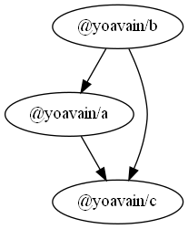

###Pre-Requisites:
* Setup local registry `verdaccio`

## Purpose of this project
* Playground environment to test lerna (including `lerna publish`)
* Hoisting example
* Working with `package-lock.json` files


install dependencies:
```
npm install
```

bootstrap:
```
lerna bootstrap --force-local
```

list:
```
lerna list --toposort --long
```


